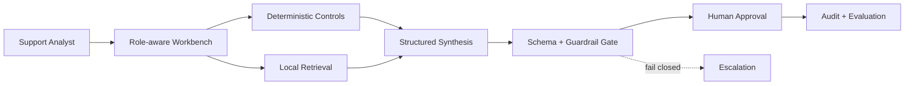

# Murex FDE Workbench

**An open-source simulation of AI Forward Deployed Engineering in a capital-markets environment.**

Murex FDE Workbench is a portfolio application showing how a Forward Deployed Engineer studies, redesigns, deploys, evaluates, and justifies an AI-assisted reporting-exception workflow at fictional **HarbourView Bank**. It is deliberately not a chatbot. The core product is a controlled case workflow in which deterministic services gather facts, retrieval supplies approved guidance, bounded AI synthesises cited recommendations, and an accountable analyst approves or rejects the next action.

## What the project demonstrates

- Discovery of the real reporting process, including stakeholder conflicts and operating incentives
- Explicit decisions about where deterministic software, AI assistance, and human judgment belong
- Five realistic end-to-end exception scenarios across risk, finance, operations, and regulatory reporting
- Evidence lineage, uncertainty, fail-closed behavior, approval gates, audit events, and safe observability
- A synthetic evaluation dashboard and transparent, conservative value model
- Role-aware views for support analysts, implementation engineers, and programme sponsors

## Screens

The current application includes an Engagement Overview/FDE Report, Current-State Workflow Map, Stakeholder Interview Findings, AI Opportunity Matrix, Incident Queue, Incident Detail within the Investigation Workspace, Evidence Viewer, Approval Queue within each case, Evaluation Dashboard and case framing, Observability and Traces, Governance Controls, ROI and Value Dashboard, Architecture and System Boundaries, and Demo Scenario Launcher.

> Screenshot assets will be added after the visual design stabilises. The running application is the authoritative demonstration.

## Architecture



The demo is TypeScript-first and local-first. The default mock provider makes it usable without a paid model API. The first slice uses device-local interaction state; planned persistence adapters target SQLite/D1 for the hosted demo and PostgreSQL for conventional deployment. Core workflow logic is intentionally explicit rather than hidden behind a large agent framework.

## Local demo

Requirements: Node.js 22.13 or later.

```bash
npm install
npm run dev
```

Open the local URL printed by the development server. Start in **Demo launcher**, select a scenario, run the controlled investigation, inspect citations, and record an approval decision.

```bash
npm run build
npm test
npm run lint
```

## Evaluation

The evaluation view documents the intended 30-case golden suite and its release gates. Current dashboard results are labelled **simulated** and are not claims about a production model. The implementation plan tracks extraction of the workflow and benchmark into executable, versioned server-side packages.

## Security model

- No production connectivity or data-mutation tool exists
- Closed synthetic evidence set with source IDs and trust metadata
- Structured outputs, confidence thresholds, and fail-closed critical handling
- Explicit analyst approval before operational disposition
- Role boundaries, redacted traces, idempotency, timeouts, retry and step limits
- Retrieved text is treated as untrusted evidence, never as executable instruction

See `docs/threat-model.md` and `docs/ai-decision-boundaries.md`.

## Limitations

- Educational portfolio simulation, not production software or a real platform integration
- Synthetic scenarios and simulated performance/value metrics
- Mock synthesis in the default build; external provider adapters are roadmap work
- Device-local approval state in the first vertical slice
- No authentication, production deployment controls, or regulated-record retention implementation

## Roadmap

The detailed checklist is in `PLAN.md`. Near-term work: persistent storage, 30+ executable golden cases, provider adapters, server-side RBAC, and full API/workflow/security/end-to-end tests.

## Contributing

Contributions should preserve the intellectual-property boundary, use synthetic data, add tests for domain behavior, and document any change to AI decision boundaries. Open an issue before adding a provider or a new operational action. A full contributing guide and community templates are planned in the repository hygiene milestone.

## Intellectual-property disclaimer

Murex is a trademark of its respective owner. This project is not affiliated with or endorsed by Murex. All bank names, schemas, workflows, trades, incidents, logs, and reports are fictional. The application is an educational FDE demonstration, not a production Murex integration. It contains no proprietary source code, schemas, screens, documentation, client data, configuration, credentials, or connectivity.

## Licence

MIT — see `LICENSE`.

