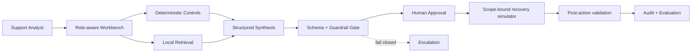

# Murex FDE Workbench

**An open-source simulation of AI Forward Deployed Engineering in a capital-markets environment.**

Murex FDE Workbench is a portfolio application showing how a Forward Deployed Engineer studies, redesigns, deploys, evaluates, and justifies an AI-assisted reporting-exception workflow at fictional **HarbourView Bank**. It is deliberately not a chatbot. The core product is a controlled case workflow in which deterministic services gather facts, retrieval supplies approved guidance, bounded AI synthesises cited recommendations, and an accountable analyst approves or rejects the next action.

## Live demonstration

**[Open the Murex FDE Workbench →](https://murex-fde-workbench.thekhoza.chatgpt.site)**

No setup, credentials, or model API key is required. For the flagship demonstration, open `HVB-2847` and follow the nine-stage workflow from stale-FX incident to deterministically validated closure. **Demo launcher → Start one-click tour** remains available as a shorter orientation across all three executable cases.

## Flagship scenario: HVB-2847

`HVB-2847` is a synthetic Daily Market Risk exception: APAC FX delta moved 18.4%, AUD 12.8m of exposure is concentrated in USD/JPY-sensitive positions, and report distribution is held. The valuation batch completed, but deterministic freshness evidence shows that the USD/JPY observation predates the required boundary. This demonstrates a central production-support judgment: successful downstream processing does not prove data completeness or freshness.

The cited recommendation proposes a single allow-listed action: `refresh_fx_market_data_and_rerun_risk_controls`. A reviewer must approve the current recommendation version and evidence snapshot. The action layer then rechecks citations, policy, evidence completeness, confidence, allow-list, source confirmation, distribution hold, and idempotency before it can simulate refreshing the isolated FX input and rerunning only the affected APAC controls.

Execution creates fresh deterministic evidence for timestamp freshness, the scoped risk rerun, population, reconciliation, and report-distribution state. The provider cannot declare success. `RESOLVED` is produced only by `deterministic_resolution_policy` when all five controls pass. A validation failure leaves distribution held, sets the run to `requires_escalation`, and records the failed controls.

### What this demo proves

- **Murex and production-support thinking:** a completed batch is separated from input freshness; affected exposure, movement concentration, source ownership, rerun scope, reconciliation, and report-distribution controls all matter.
- **Agentic AI engineering:** an explicit orchestrator gathers evidence, retrieves trusted guidance, validates cited synthesis, applies policy, enforces an action allow-list, gathers post-action evidence, and manages deterministic state transitions.
- **Enterprise governance:** uncertainty remains visible, untrusted retrieval cannot authorise action, consequential execution is approval-gated and scope-bound, rejection is safe, and closure depends on validation rather than a successful command.

### Why this is not a chatbot

The user does not ask an unconstrained model for an answer. Typed inputs run through deterministic tools; retrieval results retain trust and provenance; synthesis must conform to a schema and cite executed evidence; policy can fail closed; an accountable reviewer controls the action boundary; the simulator enforces the approved scope; and every transition is persisted. The model drafts a bounded assessment inside a controlled case workflow—it does not own facts, permissions, execution, or closure.

## What the project demonstrates

- Discovery of the real reporting process, including stakeholder conflicts and operating incentives
- Explicit decisions about where deterministic software, AI assistance, and human judgment belong
- Three executable, persisted investigations and two clearly identified previews
- A shared architecture that handles stale market data, legitimate P&L movement, and a critical incident that progresses from contradictory evidence to approved, validated synthetic recovery
- Evidence lineage, uncertainty, fail-closed behavior, approval gates, audit events, and safe observability
- A synthetic evaluation dashboard and transparent, conservative value model
- Role-aware views for support analysts, implementation engineers, and programme sponsors

## Screens

The current application includes an Engagement Overview/FDE Report, Current-State Workflow Map, Stakeholder Interview Findings, AI Opportunity Matrix, Incident Queue, Incident Detail within the Investigation Workspace, Evidence Viewer, Approval Queue within each case, Evaluation Dashboard and case framing, Observability and Traces, Governance Controls, ROI and Value Dashboard, Architecture and System Boundaries, and Demo Scenario Launcher.

> Screenshot assets will be added after the visual design stabilises. The running application is the authoritative demonstration.

## Architecture



The demo is TypeScript-first and local-first. A typed scenario registry selects structured input and deterministic adapters—not a final answer. `HVB-2847` derives a stale timestamp and affected exposure, then continues through allow-listed recovery and deterministic validation; `HVB-2829` derives its market/sensitivity/carry/new-trade P&L explain and passing controls; `HVB-2822` first derives missing evidence, competing hypotheses, and deadline risk, then expands the evidence packet to support a scoped recovery. All three share retrieval, provider interface, citation/fact validation, policy, D1 persistence, approval, audit, trace, APIs, and evaluation. The two recovery-capable scenarios use the same simulator contract and have no production connectivity.

## Local demo

Requirements: Node.js 22.13 or later.

```bash
npm install
npm run dev
```

Open the local URL printed by the development server. Start in **Demo launcher**, select a scenario, run the controlled investigation, inspect citations, and record an approval decision.

```bash
npm run build
npm test
npm run lint
npm run typecheck
npm run eval
npm run eval -- --case HVB-2847
npm run eval -- --case HVB-2829
npm run eval -- --case HVB-2822
```

The local Cloudflare preview uses the `DB` D1 binding. `npm run db:reset` recreates the checked-in schema and `npm run db:seed` inserts all three structured synthetic inputs. The hosted site owns its D1 resource; no database credentials are required.

## Evaluation

The evaluation screen runs `GOLDEN-HVB-2847-v1`, `GOLDEN-HVB-2829-v1`, and `GOLDEN-HVB-2822-v1` through the same workflow used by the UI and persists their run IDs and measured results. Each case scores seventeen dimensions: the original twelve investigation checks plus action allow-list, preconditions, post-action evidence, deterministic resolution, and remediation-audit completeness. The `HVB-2847` golden case executes the full happy path. Negative-path integration tests cover missing and stale approval, disallowed action, duplicate execution, validation failure, and invalid citation/policy state. The 30-case suite is explicitly roadmap.

## Security model

- No production connectivity exists; the only write-like capabilities are incident-specific deterministic simulations for `HVB-2847` and `HVB-2822`
- Closed synthetic evidence set with source IDs and trust metadata
- Structured outputs, confidence thresholds, and fail-closed critical handling
- Explicit analyst approval before operational disposition
- Role boundaries, redacted traces, idempotency, timeouts, retry and step limits
- Retrieved text is treated as untrusted evidence, never as executable instruction

See `docs/threat-model.md` and `docs/ai-decision-boundaries.md`.

## Limitations

- Educational portfolio simulation, not production software or a real platform integration
- Synthetic scenarios and simulated performance/value metrics
- Mock synthesis in the default build; external provider adapters are roadmap work
- Shared public-demo D1 state; demo identity is labelled and is not authentication
- No production authentication, tenant isolation, production deployment controls, or regulated-record retention implementation
- Two scenario narratives remain presentation previews rather than executable workflows

## Roadmap

The detailed checklist is in `PLAN.md`. Near-term work: expand toward 30 golden cases, add provider adapters and authenticated tenant isolation, integrate external evidence sources, and establish production-grade retention and operational controls.

## Contributing

Contributions should preserve the intellectual-property boundary, use synthetic data, add tests for domain behavior, and document any change to AI decision boundaries. Open an issue before adding a provider or a new operational action. A full contributing guide and community templates are planned in the repository hygiene milestone.

## Intellectual-property disclaimer

Murex is a trademark of its respective owner. This project is not affiliated with or endorsed by Murex. All bank names, schemas, workflows, trades, incidents, logs, and reports are fictional. The application is an educational FDE demonstration, not a production Murex integration. It contains no proprietary source code, schemas, screens, documentation, client data, configuration, credentials, or connectivity.

## Licence

MIT — see `LICENSE`.
