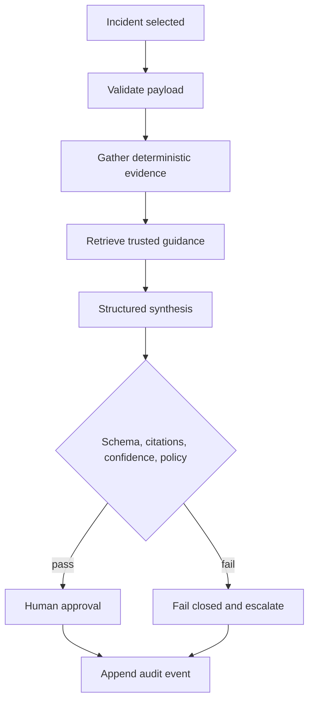
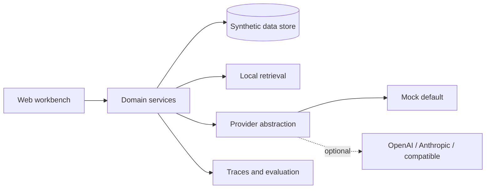

# Architecture

The deterministic layer owns facts and state transitions. Retrieval returns attributable documents. The AI layer receives only the bounded evidence packet and returns a strict recommendation schema. The guardrail layer verifies references and policy before an approval can be requested. The demo has no production write container or tool.

