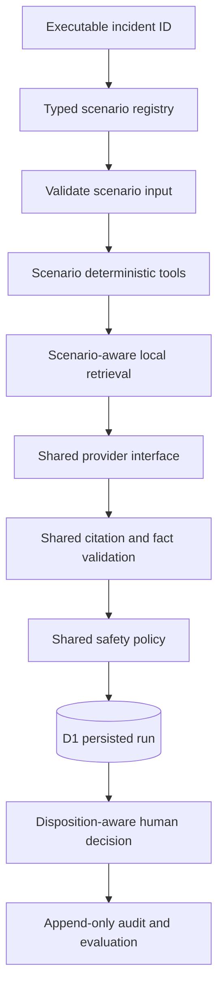

# Architecture

The registry selects structured input and deterministic tool adapters for `HVB-2847`, `HVB-2829`, or `HVB-2822`. It does not select a final answer. All scenarios then use the same orchestration, provider interface, recommendation schema, citation validation, policy engine, repository contract, audit model, trace model, APIs, and evaluation runner.

`HVB-2847` derives a stale observation and AUD 12.8m exposure. `HVB-2829` derives market movement, sensitivity P&L, residual, population, timestamp, currency, materiality, and batch controls. `HVB-2822` derives missing-manifest state, segment reconciliation, timeout occurrence, mapping status, deadline risk, severity, contradictions, and evidence completeness.

Retrieval preserves trust and provenance. Historical incidents are context, never direct current proof; instruction-like untrusted documents are penalised and cannot validate as citations. The context-driven deterministic mock constructs recommendations from tool facts, retrieval, missing evidence, contradictions, severity, and policy constraints.

D1 needs no new tables for this milestone: existing scenario-neutral incident, run, tool, evidence, retrieval, recommendation, policy, approval, audit, evaluation-case, and evaluation-result records already support the added cases. Normalized records and validated run snapshots share one repository contract with the in-memory test adapter.

No production write path exists. A normal result can request recommendation approval. A critical failed-closed result permits only approval of its escalation disposition; root cause and resolution remain unconfirmed.
