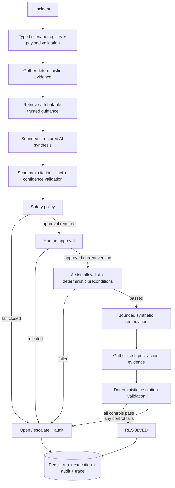

# Architecture

The registry selects structured input and deterministic tool adapters for `HVB-2847`, `HVB-2829`, or `HVB-2822`. It does not select a final answer. All scenarios then use the same orchestration, provider interface, recommendation schema, citation validation, policy engine, repository contract, audit model, trace model, APIs, and evaluation runner.

`HVB-2847` is the flagship end-to-end action case. It derives a stale USD/JPY observation, AUD 12.8m affected exposure, movement concentration, batch state, materiality, and evidence completeness. Its structured recommendation proposes one allow-listed action: `refresh_fx_market_data_and_rerun_risk_controls`. After approval, the simulator verifies the current recommendation/version, citations, policy, evidence, approval, allow-list, idempotency, confidence, source confirmation, and report hold. It then transitions the synthetic FX observation, runs a scoped APAC risk cycle, and gathers five new validation records. Resolution is computed from those records—not from the provider response.

`HVB-2829` derives market movement, sensitivity P&L, residual, population, timestamp, currency, materiality, and batch controls. `HVB-2822` remains a progressive critical case: its first pass fails closed, then a separately audited evidence-expansion transition can support its existing segment-level synthetic recovery. Both recovery-capable incidents use the same action contract and workflow function; there is no parallel engine.

Retrieval preserves trust and provenance. Historical incidents are context, never direct current proof; instruction-like untrusted documents are penalised and cannot validate as citations. The context-driven deterministic mock constructs recommendations from tool facts, retrieval, missing evidence, contradictions, severity, and policy constraints.

D1 needs no new tables for this milestone: the existing scenario-neutral run snapshot persists the structured execution record, while normalized evidence and audit records retain post-action lineage. The execution record contains its ID, incident, action ID, recommendation version, approving and executing actors, timestamps, preconditions, synthetic steps, validation evidence, deterministic resolution, and trace/run linkage. The same repository contract is exercised by the in-memory tests.

No production write integration exists. The action API accepts an investigation ID and explicit action ID, then rejects anything outside the incident-specific allow-list. It cannot execute shell commands, SQL, model-generated code, arbitrary HTTP/API calls, or external integrations. `HVB-2847` can only run its FX refresh-and-risk-control simulation; `HVB-2822` can only run its segment recovery simulation. Rejected, missing, stale-version, invalid-citation, policy-failed, low-confidence, incomplete-evidence, or duplicate requests fail closed and append a rejected-precondition audit event.

The model proposes. Deterministic systems establish facts, validate citations, apply policy, authorise the exact state transition, execute the bounded simulation, gather new evidence, and determine final state. `RESOLVED` requires every configured post-action control to pass. A failed freshness, reconciliation, population, rerun, or distribution control produces `VALIDATION_FAILED`, retains the report hold, sets the run to `requires_escalation`, and records `incident.escalated`.

## Hallucination and unsupported-inference controls

- Structured incident schemas and deterministic calculations establish observations before synthesis.
- Evidence records carry an ID, source, timestamp, signal, relevance, and producing tool.
- Candidate factual claims and actions must cite evidence executed in the current run or approved retrieved guidance.
- Untrusted or instruction-like documents cannot validate as citations.
- Historical incidents remain contextual and cannot override a current control.
- Missing evidence is represented explicitly and causes policy to fail closed.
- Facts, hypotheses, ruled-out causes, probable cause, uncertainty, confidence, and confidence rationale are separate fields.
- Citation validation and policy are rerun after evidence expansion; a model response cannot grant itself permission.
