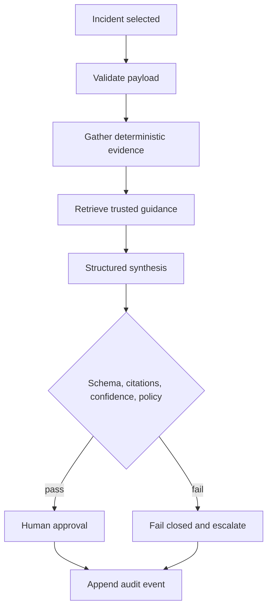
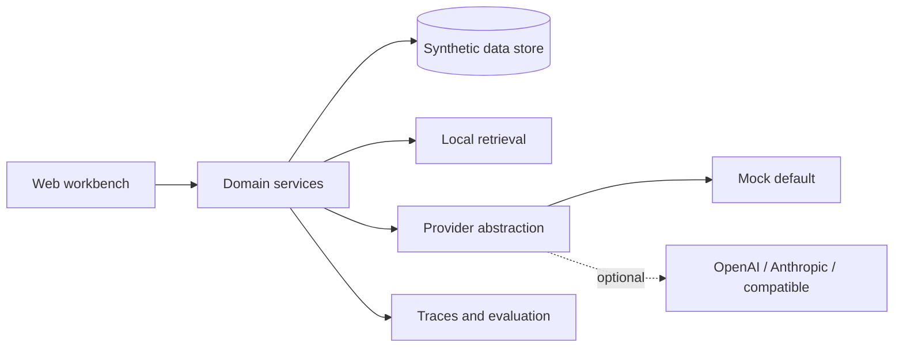
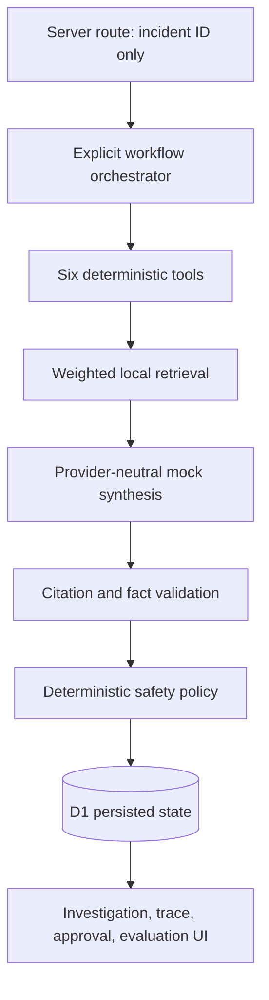

# Architecture

The deterministic layer owns facts and state transitions. Retrieval returns attributable documents and down-ranks unapproved instruction-like content. The provider layer receives only the bounded evidence packet and returns a strict recommendation schema. Citation validation verifies every evidence ID, executed-tool lineage, batch-fact consistency, confidence, and protected-record actions. The policy layer can override synthesis and fail closed before approval.

`HVB-2847` is implemented through `POST /api/investigations`, `POST /api/approvals`, and `POST /api/evaluations`. D1 stores normalized records plus a validated run snapshot. Tests use an in-memory repository behind the same contract. The four other incident stories remain client-side previews and the demo has no production write tool.

