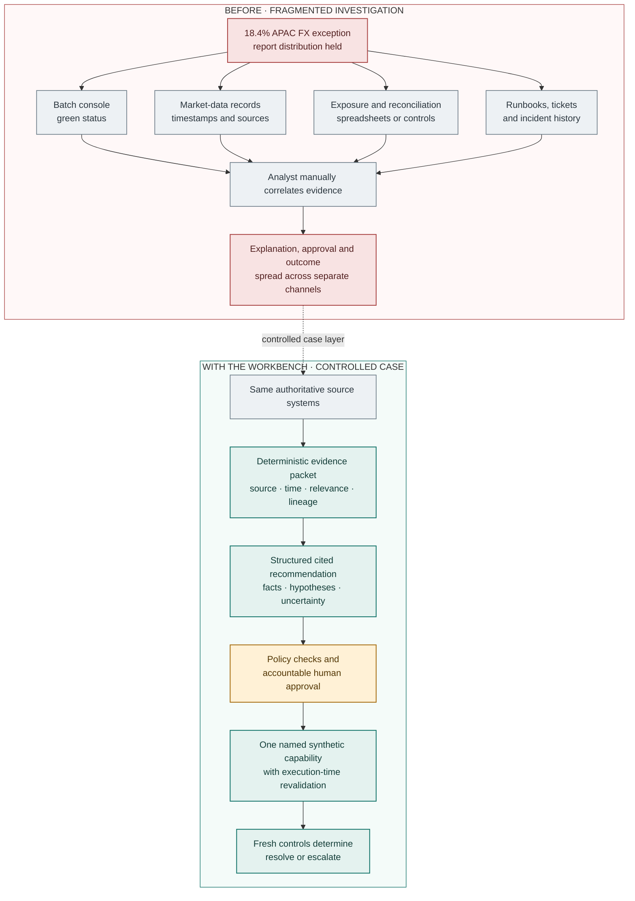

# Before Versus With the Workbench

```mermaid
flowchart TB
    subgraph BEFORE["BEFORE · FRAGMENTED INVESTIGATION"]
        direction TB
        B0["18.4% APAC FX exception<br/>report distribution held"]
        B1["Batch console<br/>green status"]
        B2["Market-data records<br/>timestamps and sources"]
        B3["Exposure and reconciliation<br/>spreadsheets or controls"]
        B4["Runbooks, tickets<br/>and incident history"]
        B5["Analyst manually correlates evidence"]
        B6["Explanation, approval and outcome<br/>spread across separate channels"]
        B0 --> B1
        B0 --> B2
        B0 --> B3
        B0 --> B4
        B1 --> B5
        B2 --> B5
        B3 --> B5
        B4 --> B5
        B5 --> B6
    end

    subgraph WITH["WITH THE WORKBENCH · CONTROLLED CASE"]
        direction TB
        W0["Same authoritative source systems"]
        W1["Deterministic evidence packet<br/>source · time · relevance · lineage"]
        W2["Structured cited recommendation<br/>facts · hypotheses · uncertainty"]
        W3["Policy checks and<br/>accountable human approval"]
        W4["One named synthetic capability<br/>with execution-time revalidation"]
        W5["Fresh controls determine<br/>resolve or escalate"]
        W0 --> W1 --> W2 --> W3 --> W4 --> W5
    end

    B6 -. "controlled case layer" .-> W0

    classDef problem fill:#f8e3e3,stroke:#aa4545,color:#522020,stroke-width:1.5px
    classDef source fill:#edf1f4,stroke:#687884,color:#2b363e,stroke-width:1.2px
    classDef control fill:#e4f2ef,stroke:#17766c,color:#133d38,stroke-width:1.5px
    classDef decision fill:#fff1d6,stroke:#a76e12,color:#523604,stroke-width:1.5px
    class B0,B6 problem
    class B1,B2,B3,B4,B5,W0 source
    class W1,W2,W4,W5 control
    class W3 decision
    style BEFORE fill:#fff8f8,stroke:#aa4545
    style WITH fill:#f4fbf9,stroke:#17766c
```

The workbench does not replace systems of record. It controls how evidence becomes a recommendation, a decision, and—only where permitted—a validated action.
