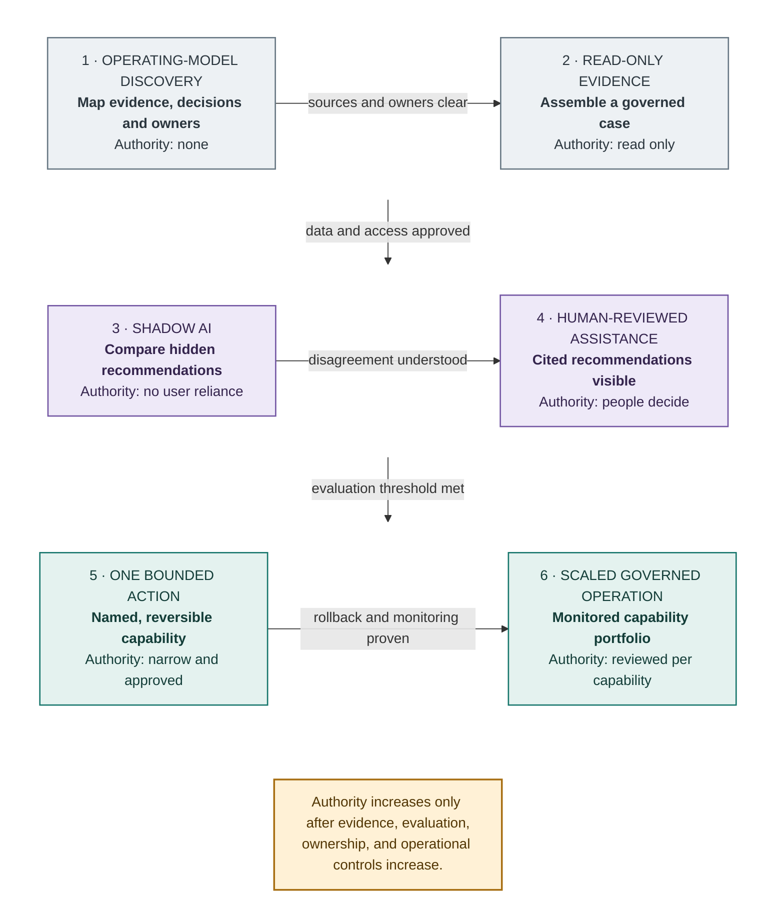

# Deployment Journey

```mermaid
flowchart TB
    subgraph ROW1[" "]
        direction LR
        S1["1 · OPERATING-MODEL DISCOVERY<br/><b>Map evidence, decisions and owners</b><br/>Authority: none"]
        S2["2 · READ-ONLY EVIDENCE<br/><b>Assemble a governed case</b><br/>Authority: read only"]
        S1 -->|"sources and owners clear"| S2
    end
    subgraph ROW2[" "]
        direction LR
        S3["3 · SHADOW AI<br/><b>Compare hidden recommendations</b><br/>Authority: no user reliance"]
        S4["4 · HUMAN-REVIEWED ASSISTANCE<br/><b>Cited recommendations visible</b><br/>Authority: people decide"]
        S3 -->|"disagreement understood"| S4
    end
    subgraph ROW3[" "]
        direction LR
        S5["5 · ONE BOUNDED ACTION<br/><b>Named, reversible capability</b><br/>Authority: narrow and approved"]
        S6["6 · SCALED GOVERNED OPERATION<br/><b>Monitored capability portfolio</b><br/>Authority: reviewed per capability"]
        S5 -->|"rollback and monitoring proven"| S6
    end

    PRINCIPLE["Authority increases only after evidence, evaluation,<br/>ownership, and operational controls increase."]
    ROW1 -->|"data and access approved"| ROW2
    ROW2 -->|"evaluation threshold met"| ROW3
    ROW3 ~~~ PRINCIPLE

    classDef early fill:#edf1f4,stroke:#687884,color:#2b363e,stroke-width:1.5px
    classDef assist fill:#eee9f8,stroke:#7356a3,color:#34244d,stroke-width:1.5px
    classDef controlled fill:#e4f2ef,stroke:#17766c,color:#133d38,stroke-width:1.5px
    classDef principle fill:#fff1d6,stroke:#a76e12,color:#523604,stroke-width:2px
    class S1,S2 early
    class S3,S4 assist
    class S5,S6 controlled
    class PRINCIPLE principle
    style ROW1 fill:none,stroke:none
    style ROW2 fill:none,stroke:none
    style ROW3 fill:none,stroke:none
```

Each stage requires institution-specific evidence and governance. The sequence is illustrative future design, not the current deployment state.
