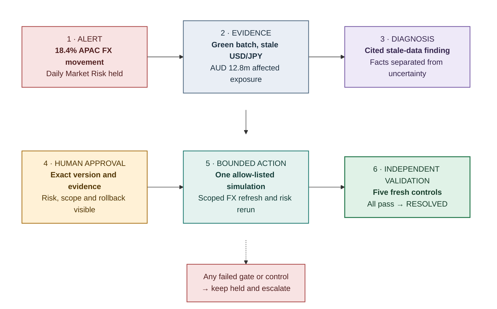

# Flagship Scenario in Six Frames

```mermaid
flowchart TB
    subgraph ROW1[" "]
        direction LR
        F1["1 · ALERT<br/><b>18.4% APAC FX movement</b><br/>Daily Market Risk held"]
        F2["2 · EVIDENCE<br/><b>Green batch, stale USD/JPY</b><br/>AUD 12.8m affected exposure"]
        F3["3 · DIAGNOSIS<br/><b>Cited stale-data finding</b><br/>Facts separated from uncertainty"]
        F1 --> F2 --> F3
    end
    subgraph ROW2[" "]
        direction LR
        F4["4 · HUMAN APPROVAL<br/><b>Exact version and evidence</b><br/>Risk, scope and rollback visible"]
        F5["5 · BOUNDED ACTION<br/><b>One allow-listed simulation</b><br/>Scoped FX refresh and risk rerun"]
        F6["6 · INDEPENDENT VALIDATION<br/><b>Five fresh controls</b><br/>All pass → RESOLVED"]
        F4 --> F5 --> F6
    end
    FAIL["Any failed gate or control<br/>→ keep held and escalate"]
    ROW1 --> ROW2
    ROW2 -.-> FAIL

    classDef signal fill:#f8e3e3,stroke:#aa4545,color:#522020,stroke-width:1.5px
    classDef evidence fill:#e9eef5,stroke:#4d6780,color:#1d3141,stroke-width:1.5px
    classDef ai fill:#eee9f8,stroke:#7356a3,color:#34244d,stroke-width:1.5px
    classDef human fill:#fff1d6,stroke:#a76e12,color:#523604,stroke-width:1.5px
    classDef action fill:#e4f2ef,stroke:#17766c,color:#133d38,stroke-width:1.5px
    classDef success fill:#e0f2e7,stroke:#2d7d53,color:#173e2b,stroke-width:2px
    classDef failure fill:#f8e3e3,stroke:#aa4545,color:#522020,stroke-width:1.5px
    class F1 signal
    class F2 evidence
    class F3 ai
    class F4 human
    class F5 action
    class F6 success
    class FAIL failure
    style ROW1 fill:none,stroke:none
    style ROW2 fill:none,stroke:none
```

All figures and actions are synthetic. The final state is produced by deterministic controls, not by the synthesis provider.
