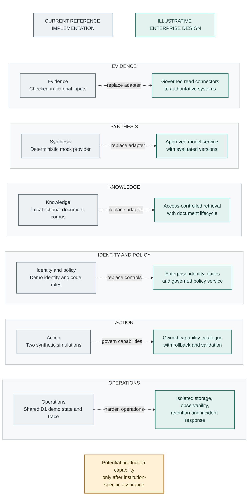

# Reference Implementation to Enterprise Deployment

```mermaid
flowchart TB
    subgraph HEADERS[" "]
        direction LR
        CURRENT["CURRENT REFERENCE IMPLEMENTATION"]
        ENTERPRISE["ILLUSTRATIVE ENTERPRISE DESIGN"]
        CURRENT ~~~ ENTERPRISE
    end

    subgraph EVIDENCE["EVIDENCE"]
        direction LR
        C1["Evidence<br/>Checked-in fictional inputs"]
        E1["Governed read connectors<br/>to authoritative systems"]
        C1 -. "replace adapter" .-> E1
    end

    subgraph SYNTHESIS["SYNTHESIS"]
        direction LR
        C2["Synthesis<br/>Deterministic mock provider"]
        E2["Approved model service<br/>with evaluated versions"]
        C2 -. "replace adapter" .-> E2
    end

    subgraph KNOWLEDGE["KNOWLEDGE"]
        direction LR
        C3["Knowledge<br/>Local fictional document corpus"]
        E3["Access-controlled retrieval<br/>with document lifecycle"]
        C3 -. "replace adapter" .-> E3
    end

    subgraph IDENTITY["IDENTITY AND POLICY"]
        direction LR
        C4["Identity and policy<br/>Demo identity and code rules"]
        E4["Enterprise identity, duties<br/>and governed policy service"]
        C4 -. "replace controls" .-> E4
    end

    subgraph ACTION["ACTION"]
        direction LR
        C5["Action<br/>Two synthetic simulations"]
        E5["Owned capability catalogue<br/>with rollback and validation"]
        C5 -. "govern capabilities" .-> E5
    end

    subgraph OPERATIONS["OPERATIONS"]
        direction LR
        C6["Operations<br/>Shared D1 demo state and trace"]
        E6["Isolated storage, observability,<br/>retention and incident response"]
        C6 -. "harden operations" .-> E6
    end

    FUTURE["Potential production capability<br/>only after institution-specific assurance"]
    HEADERS ~~~ EVIDENCE ~~~ SYNTHESIS ~~~ KNOWLEDGE ~~~ IDENTITY ~~~ ACTION ~~~ OPERATIONS ~~~ FUTURE

    classDef current fill:#edf1f4,stroke:#687884,color:#2b363e,stroke-width:1.5px
    classDef enterprise fill:#e4f2ef,stroke:#17766c,color:#133d38,stroke-width:1.5px
    classDef future fill:#fff1d6,stroke:#a76e12,color:#523604,stroke-width:2px
    class CURRENT,C1,C2,C3,C4,C5,C6 current
    class ENTERPRISE,E1,E2,E3,E4,E5,E6 enterprise
    class FUTURE future
    style HEADERS fill:none,stroke:none
    style EVIDENCE fill:#f7f9fa,stroke:#c4cdd4
    style SYNTHESIS fill:#f7f9fa,stroke:#c4cdd4
    style KNOWLEDGE fill:#f7f9fa,stroke:#c4cdd4
    style IDENTITY fill:#f7f9fa,stroke:#c4cdd4
    style ACTION fill:#f7f9fa,stroke:#c4cdd4
    style OPERATIONS fill:#f7f9fa,stroke:#c4cdd4
```

The right-hand side is a proposed architecture pattern, not implemented functionality or a production-readiness claim.
