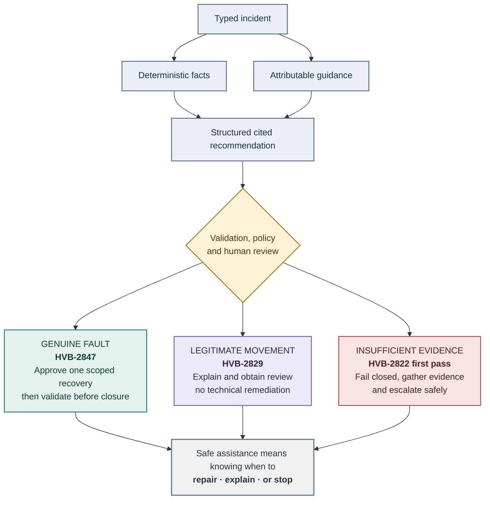

# Three Outcomes, One Workflow

The scenario registry selects inputs and deterministic adapters. The three cases still share orchestration, validation, policy, approval, audit, persistence and evaluation layers.
