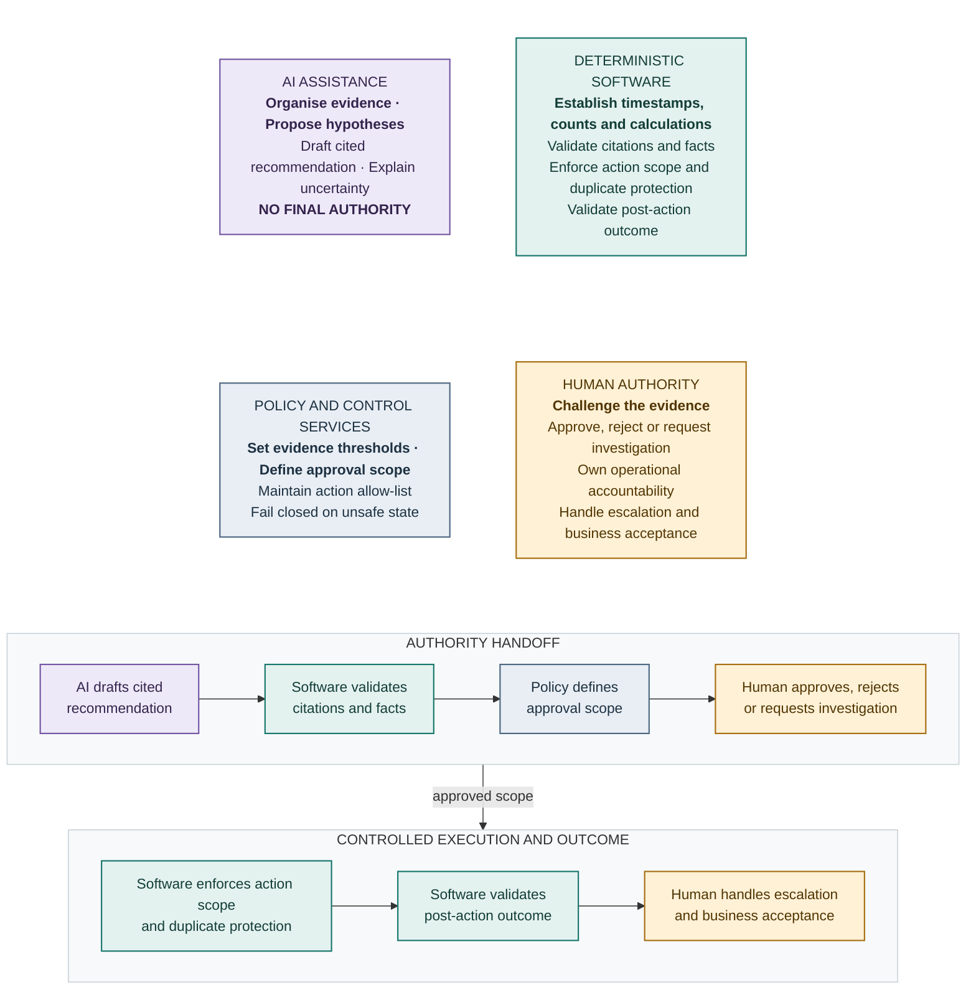

# Who Controls What?

```mermaid
flowchart TB
    subgraph OWN1[" "]
        direction LR
        AI_R["AI ASSISTANCE<br/><b>Organise evidence · Propose hypotheses</b><br/>Draft cited recommendation · Explain uncertainty<br/><b>NO FINAL AUTHORITY</b>"]
        DET_R["DETERMINISTIC SOFTWARE<br/><b>Establish timestamps, counts and calculations</b><br/>Validate citations and facts<br/>Enforce action scope and duplicate protection<br/>Validate post-action outcome"]
        AI_R ~~~ DET_R
    end

    subgraph OWN2[" "]
        direction LR
        POLICY_R["POLICY AND CONTROL SERVICES<br/><b>Set evidence thresholds · Define approval scope</b><br/>Maintain action allow-list<br/>Fail closed on unsafe state"]
        HUMAN_R["HUMAN AUTHORITY<br/><b>Challenge the evidence</b><br/>Approve, reject or request investigation<br/>Own operational accountability<br/>Handle escalation and business acceptance"]
        POLICY_R ~~~ HUMAN_R
    end

    OWN1 ~~~ OWN2

    subgraph FLOW1["AUTHORITY HANDOFF"]
        direction LR
        A3["AI drafts cited<br/>recommendation"]
        D2["Software validates<br/>citations and facts"]
        P2["Policy defines<br/>approval scope"]
        H2["Human approves, rejects<br/>or requests investigation"]
        A3 --> D2 --> P2 --> H2
    end

    subgraph FLOW2["CONTROLLED EXECUTION AND OUTCOME"]
        direction LR
        D3["Software enforces action scope<br/>and duplicate protection"]
        D4["Software validates<br/>post-action outcome"]
        H4["Human handles escalation<br/>and business acceptance"]
        D3 --> D4 --> H4
    end

    OWN2 ~~~ FLOW1
    FLOW1 -->|"approved scope"| FLOW2

    classDef ai fill:#eee9f8,stroke:#7356a3,color:#34244d,stroke-width:1.5px
    classDef deterministic fill:#e4f2ef,stroke:#17766c,color:#133d38,stroke-width:1.5px
    classDef policy fill:#e9eef5,stroke:#4d6780,color:#1d3141,stroke-width:1.5px
    classDef human fill:#fff1d6,stroke:#a76e12,color:#523604,stroke-width:1.5px
    class AI_R,A3 ai
    class DET_R,D2,D3,D4 deterministic
    class POLICY_R,P2 policy
    class HUMAN_R,H2,H4 human
    style OWN1 fill:none,stroke:none
    style OWN2 fill:none,stroke:none
    style FLOW1 fill:#f7f9fa,stroke:#c4cdd4
    style FLOW2 fill:#f7f9fa,stroke:#c4cdd4
```

AI can assist with interpretation and communication. It cannot approve itself, create execution authority, or decide that an incident is resolved.
