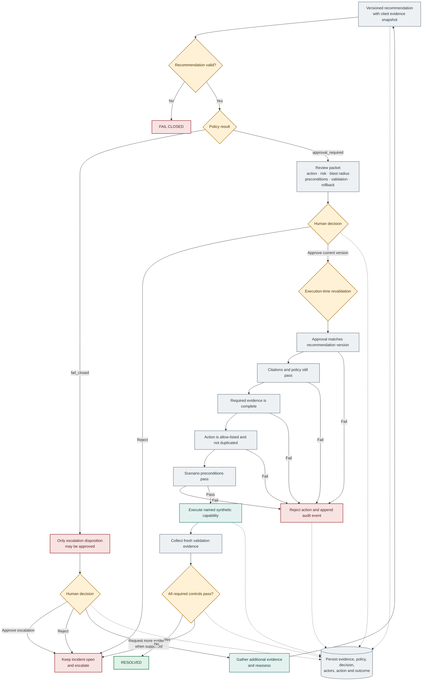

# Technical Approval and Governance Flow

Approval is necessary but not sufficient. The action layer reloads persisted state and repeats the relevant checks before executing the named synthetic capability.
