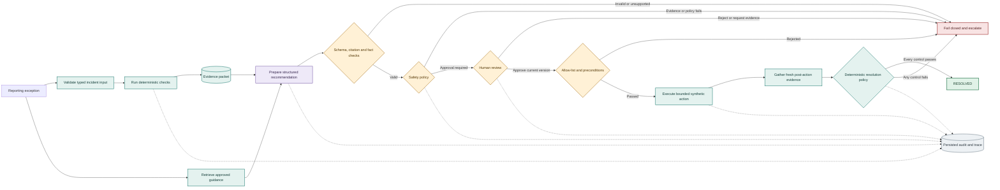

# Technical High-Level Investigation Workflow

```mermaid
flowchart LR
    I["Reporting exception"] --> V["Validate typed incident input"]
    V --> T["Run deterministic checks"]
    T --> E[("Evidence packet")]
    I --> R["Retrieve approved guidance"]
    E --> S["Prepare structured recommendation"]
    R --> S
    S --> C{"Schema, citation and fact checks"}
    C -->|"Invalid or unsupported"| X["Fail closed and escalate"]
    C -->|"Valid"| P{"Safety policy"}
    P -->|"Evidence or policy fails"| X
    P -->|"Approval required"| H{"Human review"}
    H -->|"Reject or request evidence"| X
    H -->|"Approve current version"| G{"Allow-list and preconditions"}
    G -->|"Rejected"| X
    G -->|"Passed"| A["Execute bounded synthetic action"]
    A --> N["Gather fresh post-action evidence"]
    N --> D{"Deterministic resolution policy"}
    D -->|"Every control passes"| OK["RESOLVED"]
    D -->|"Any control fails"| X

    AU[("Persisted audit and trace")]
    T -.-> AU
    S -.-> AU
    P -.-> AU
    H -.-> AU
    A -.-> AU
    D -.-> AU

    classDef deterministic fill:#e4f2ef,stroke:#17766c,color:#133d38,stroke-width:1.5px
    classDef ai fill:#eee9f8,stroke:#7356a3,color:#34244d,stroke-width:1.5px
    classDef decision fill:#fff1d6,stroke:#a76e12,color:#523604,stroke-width:1.5px
    classDef outcome fill:#e0f2e7,stroke:#2d7d53,color:#173e2b,stroke-width:2px
    classDef failure fill:#f8e3e3,stroke:#aa4545,color:#522020,stroke-width:2px
    classDef store fill:#edf1f4,stroke:#687884,color:#2b363e,stroke-width:1.5px

    class V,T,E,R,N,D deterministic
    class S ai
    class C,P,H,G decision
    class A deterministic
    class OK outcome
    class X failure
    class AU store
```

The diagram describes the implemented control pattern. The action stage is a synthetic simulation and has no production connectivity.
