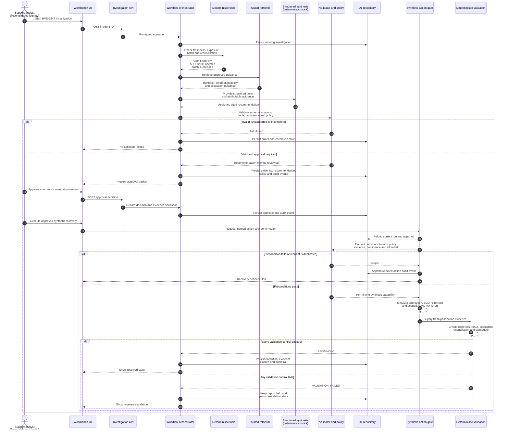

# Technical Stale Market-Data Scenario Sequence

All names, values, identities, and actions in this sequence are fictional. The remediation step is a controlled simulation and does not contact a production system.
