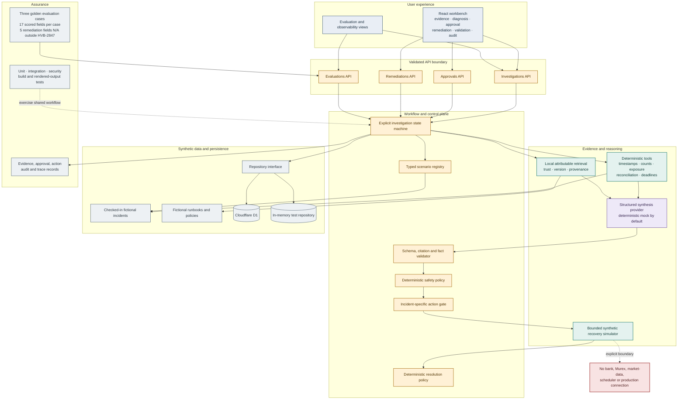

# Technical System Architecture

The public runtime uses D1. Tests use the same repository contract with an in-memory implementation. The default provider is deterministic and local, not an external language model.
