# Murex FDE Workbench

**Controlled AI-assisted investigation for capital-markets production support**

## 1. The morning exception problem

Daily Market Risk opens with an **18.4% APAC FX movement**. The overnight valuation batch is green, yet the report cannot safely be released. A freshness check shows that the USD/JPY observation predates the required boundary, and deterministic exposure calculations identify **AUD 12.8m** in affected positions.

The support analyst must answer three questions under time pressure: Is this a genuine fault? What evidence supports the diagnosis? What can happen next without creating a larger control problem?

The pressure is operational as well as analytical. Market Risk needs a release decision, Market Data Operations needs a precise defect to investigate, and production support needs a recovery path that will not widen the incident. A green batch proves that processing completed; it does not prove that every input was fit for purpose.

> **Reference implementation status:** This project is a portfolio simulation using fictional data, a deterministic synthesis provider, a labelled demo identity and controlled synthetic actions. It has no connection to a real bank or production Murex environment. The enterprise architecture shown later is illustrative future design.

**[Open the public portfolio simulation](https://murex-fde-workbench.thekhoza.chatgpt.site)** or [run it locally](../README.md#run-locally). Start with `HVB-2847`.

## 2. Before versus with the workbench

Today, an analyst may move among an incident ticket, batch console, market-data records, reconciliations, runbooks and previous cases. The analysis, approval and outcome can end up spread across separate channels.

The workbench adds a controlled case layer. It does not replace authoritative systems. It gathers reproducible evidence, keeps source and time visible, prepares a cited recommendation, records the accountable decision and validates the outcome independently.

The result is one reviewable chain from signal to disposition. An operator can see what was observed, what was inferred, which rule permitted or blocked the next step, who approved it and whether fresh evidence supports closure. That chain is useful even when the correct outcome is to take no action.

[Open the Mermaid source](diagrams/presentation/before-vs-workbench.md).

## 3. What the capability is—and is not

| Open-ended chatbot | Controlled investigation workbench |
| --- | --- |
| Starts from a broad prompt | Starts from a typed incident and server-owned evidence |
| Produces conversational text | Produces a structured, versioned recommendation |
| May blur observations and inference | Separates facts, hypotheses, ruled-out causes and uncertainty |
| Relies mainly on prompt instructions | Runs independent schema, citation, factual and policy checks |
| Has no inherent approval model | Binds human approval to an exact version and evidence snapshot |
| Can appear to own the answer | Has no authority over facts, permission, execution scope or closure |

The current provider is deterministic rather than a live language model. It demonstrates where AI-assisted synthesis would sit and makes the workflow repeatable. A future provider would remain inside the same validation, policy, approval and action boundaries.

## 4. Flagship scenario in six frames

1. **Alert:** an 18.4% movement holds the Daily Market Risk report.
2. **Evidence:** the batch succeeded, but USD/JPY is stale and AUD 12.8m exposure is affected.
3. **Diagnosis:** the provider prepares a cited stale-data finding while keeping uncertainty visible.
4. **Human approval:** the reviewer sees the evidence version, action scope, risk, validation and rollback.
5. **Bounded action:** only the named synthetic FX refresh and scoped APAC risk rerun can execute.
6. **Independent validation:** freshness, rerun, population, reconciliation and distribution controls decide the outcome. Any failure keeps the report held and escalates the case.

[Read the full scenario walkthrough](solution-brief/scenario-walkthrough.md) or [open the technical sequence](diagrams/technical/stale-market-data-sequence.md).

## 5. Who controls what?

| Decision | AI assistance | Deterministic software | Policy and controls | Human authority |
| --- | --- | --- | --- | --- |
| Establish source facts | Summarises only | Calculates and records | Defines required evidence | Challenges exceptions |
| Explain the case | Proposes cited hypotheses | Checks contradictions | Sets confidence and evidence rules | Applies domain judgment |
| Permit action | Recommends only | Revalidates current state | Defines scope and allow-list | Approves or rejects the exact request |
| Execute | No capability creation | Runs one named capability | Defaults to deny | Owns accountability |
| Determine success | Explains results only | Runs fresh controls | Defines closure rules | Handles business acceptance and escalation |

**AI never has final authority.** It cannot approve itself, invent a capability or mark its own remediation successful.

[Read the control register](solution-brief/governance-and-controls.md).

## 6. Three outcomes, one workflow

| Synthetic scenario | Question | Safe outcome |
| --- | --- | --- |
| `HVB-2847` — genuine fault | Did a green batch use stale market data? | Approve one scoped recovery, then validate before closure |
| `HVB-2829` — legitimate movement | Does a material AUD 6.1m P&L movement require repair? | Explain the movement, request Product Control review and avoid remediation |
| `HVB-2822` — insufficient evidence (first pass) | Does a timeout or similar historical case prove the cause? | Fail closed and gather current evidence; scoped recovery becomes available only after evidence expansion and review |

All three use the same orchestrator, provider contract, validation, policy, approval, audit, persistence and evaluation layers. Safe assistance means knowing when to **repair, explain or stop**.

## 7. Governance gates

The workflow is constrained by a set of independent gates, each of which can stop it:

`Evidence · citation validation · policy validation · human approval · action allow-list · idempotency · post-action validation`

- **Evidence:** required current facts must exist; historical similarity remains context.
- **Citations:** claims must resolve to current-run evidence or approved guidance.
- **Policy:** incomplete, contradictory or unsafe states fail closed.
- **Approval:** the decision is tied to the exact recommendation and evidence snapshot.
- **Allow-list:** an incident can invoke only its named capability.
- **Idempotency:** a completed recovery cannot execute again for the same investigation.
- **Post-action validation:** execution is not closure; fresh controls decide resolve or escalate.

The detailed state rules are in the [governance brief](solution-brief/governance-and-controls.md) and [technical approval appendix](diagrams/technical/approval-governance-flow.md).

## 8. Evidence behind the claims

The current reference implementation contains:

- **3 executable synthetic scenarios** with distinct safe outcomes;
- **17 scored fields per golden case** through the application workflow—five remediation fields are non-applicable passes outside `HVB-2847`;
- **48 TypeScript tests**, followed by a production build and **2 rendered-output tests**; and
- positive, negative and adversarial paths.

Meaningful negative tests show that the workflow rejects fabricated citations, direct protected-record modification, unnecessary remediation, historical evidence presented as current proof, premature rerun, missing or stale approval, actions outside the allow-list and duplicate execution. A forced validation failure leaves distribution held and records escalation rather than resolution.

This evidence supports the implemented state transitions for the checked-in synthetic corpus. It does **not** prove live-model accuracy, production safety, regulatory compliance, operational scale, measured return on investment or performance on real bank data. The documented 30-case corpus remains roadmap work.

[Review the evaluation methodology](evaluation-methodology.md) or [inspect the technical implementation](solution-brief/technical-brief.md).

## 9. Reference implementation to enterprise deployment

The diagram preserves four separate claim levels:

1. **Implemented reference behavior:** typed inputs, deterministic tools, structured synthesis, validation, policy, approval, persistence and evaluation exist in this repository.
2. **Simulated capability:** two incident-specific actions record controlled synthetic recovery; no production system is contacted.
3. **Proposed enterprise architecture:** institution-owned connectors, identity, retrieval, policy, observability and capability services would replace demo adapters.
4. **Potential future production capability:** possible only after organisation-specific security, model risk, operational readiness, evaluation and change approval.

What remains constant is the control pattern. What changes is the institution's systems, evidence, roles, thresholds, action catalogue, retention and validation criteria.

Adaptation therefore starts with operating-model discovery, not model selection. Each institution would define its authoritative sources, segregated roles, materiality rules, recoverable actions and release controls. Only then could governed connectors and an evaluated model provider be introduced behind the same workflow contract.

[Read the enterprise deployment vision](solution-brief/enterprise-deployment-vision.md) or [open the current technical architecture](diagrams/technical/system-architecture.md).

## 10. Deployment journey

A safe introduction increases capability in stages:

1. Map the operating model, evidence, decisions and owners.
2. Assemble read-only evidence without AI recommendations.
3. Run AI in shadow mode and compare hidden output with reviewed decisions.
4. Expose cited recommendations while people retain every decision.
5. Add one named, reversible action after evaluation, ownership and rollback are proven.
6. Scale only through capability-level review, monitoring, access control and change governance.

> **Authority increases only after evidence, evaluation, ownership, and operational controls increase.**

## Go deeper

- [One-page executive brief](solution-brief/executive-brief.md)
- [Technical brief](solution-brief/technical-brief.md)
- [Scenario walkthrough](solution-brief/scenario-walkthrough.md)
- [Governance and controls](solution-brief/governance-and-controls.md)
- [Enterprise deployment vision](solution-brief/enterprise-deployment-vision.md)
- [Technical diagram appendix](diagrams/technical/)

Murex is a trademark of its respective owner. This independent educational project is not affiliated with or endorsed by Murex or any financial institution.
